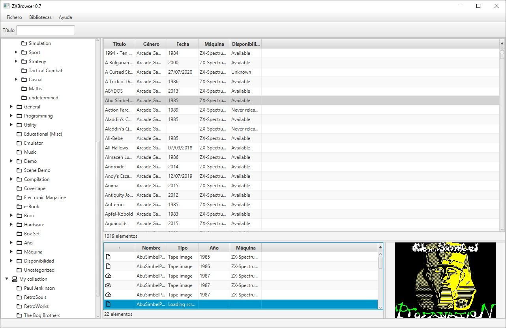
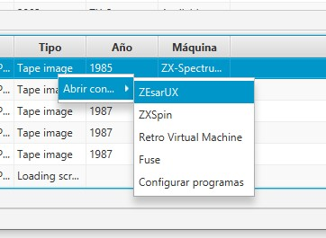
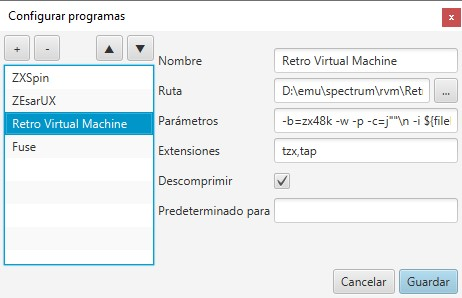

# ZXBrowser 0.7.2

### Descripción
**ZXBrowser** es una aplicación para explorar, descargar y ejecutar el contenido de la base de datos de Spectrum [ZXDB](https://github.com/zxdb/ZXDB).



### ¿Por qué?
De vez en cuando me apetece recordar los viejos juegos del Spectrum y, por supuesto, todos los nuevos que van saliendo
(que últimamente no son pocos...).

Personalmente tengo una réplica del viejo FTP de WoS y, cuando quiero jugar a algo, a
veces me cuesta encontrar el fichero. Luego, en el caso más sencillo, tengo que arrastrar el ZIP al emulador para
ejecutarlo... pero no siempre es así. A veces tienes que buscar el fichero desde el propio emulador y otras, además
tienes que descomprimirlo porque no lee directamente los ficheros comprimidos.

Por eso decidí que necesitaba algo como ZXBrowser.

La verdad es que la idea viene de lejos. De hecho tengo una vieja versión por ahí que cargaba los datos del fichero
**rainbow-wos.zip** (alojado en WoS), pero eso es otra historia...

Ahora tengo una versión medianamente decente que me gustaría compartir con todos los amantes del Spectrum, esperando que
les guste y les sea tan útil como a mí.

### Descargas
[Binarios](https://github.com/area51bis/zxbrowser-jfx/releases)

### Instrucciones
El programa es bastante sencillo. Basta con ejecutarlo y, automáticamente, descargará la base datos de ZXDB.

La ventana muestra a la izquierda un _**árbol de categorías**_ que permite explorar por género, año, etc.

Al seleccionar una categoría, se mostrará a la derecha un listado con todas las entradas correspondientes. Al
seleccionar una entrada, se mostrarán debajo las descargas disponibles.

Al pulsar botón derecho sobre una descarga se mostrarán las opciones disponibles:
- Descargar: Si no está descargado.
- Abrir con...: Para abrir con un programa en concreto.

Al hacer doble clic, automáticamente se descargará (si es necesario) y se ejecutará con el programa asignado por
defecto.

A la derecha de las descargas se muestran las imágenes si están descargadas.

También hay una caja de texto arriba para buscar rápidamente **en la categoría seleccionada**.

En cualquier momento se puede actualizar la base de datos desde el menú "*Biblioteca -> ZXDB -> Actualizar*".

### Programas
Se pueden definir y asignar programas para cualquier extensión (no sólo emuladores). Esto se puede hacer desde el menú "*Fichero -> Configurar programas*" o desde el menú contextual de las descargas (*Abrir con... -> Configurar programas*).




Al añadir un programa, si es reconocido, se configurará automáticamente con unos parámetros por defecto. Se irá mejorando y ampliando en próximas versiones. De momento reconoce los siguientes programas:

- Fuse.
- Retro Virtual Machine.
- ZEsarUX.
- ZXSpin.

También se puede editar directamente el fichero `config.json` en la sección "`programs`". Cada programa tiene la siguiente estructura:

```
{
    "name": "ZEsarUX",
    "path": "D:\\emu\\spectrum\\zesarux\\zesarux.exe",
    "args": "--noconfigfile --realloadfast --realtape ${filePath}",
    "ext": ["tzx", "tap", "z80", "sna"],
    "unzip": true,
    "default_for": ["tzx", "tap"]
}
```
- **name**: Nombre que se muestra en el menú.
- **path**: Ruta completa al ejecutable.
- **args**: Argumentos que se le pasarán al programa. Aquí se pueden indicar variables en la forma _${nombre_de_variable}_,
    pero actualmente sólo soporta una: _${filePath}_ que indica el nombre completo a la descarga.
- **ext**: Lista de extensiones que soporta el programa.
- **unzip**: Indica que necesita descomprimirse antes de ejecutarlo. Opcional.
- **default_for**: Extensiones que abrirá por defecto  al hacer doble clic. Opcional.

### Bibliotecas
A partir de la versión 0.7, ZXBrowser soporta distintos tipos de bibliotecas:
- **ZXDB**: Base de datos ZXDB descargada de forma local.
- **Local**: Cualquier directorio local de nuestro equipo.

Actualmente sólo se pueden definir en el JSON y el formato es tan sencillo que creo que se explica por sí solo:
```
"libraries": [
    {
        "type": "zxdb",
        "name": "ZXDB",
        "path": "zxdb"
    },
    {
        "type": "local",
        "name": "My collection",
        "path": "D:\\downloads\\spectrum\\my_games"
    }
]
```
- **type**: Tipo de biblioteca. De momento sólo soporta "zxdb" y "local".
- **name**: Nombre de la biblioteca.
- **path**: Ruta a la biblioteca (dónde se encuentran y/o descargan los ficheros).

### Agradecimientos
- A toda la gente que sigue disfrutando del Spectrum y hace posible que esta máquina nunca muera.
- A la vieja World of Spectrum, en la que tanto tiempo perdí recordando mi infancia y descubriendo juegos que no llegué a conocer.
- A [El Mundo del Spectrum](http://www.elmundodelspectrum.com/), sobre todo por su Podcast.
- Y, por supuesto, al equipo detrás de [ZXDB](https://github.com/zxdb/ZXDB) sin el que esto no sería posible.
